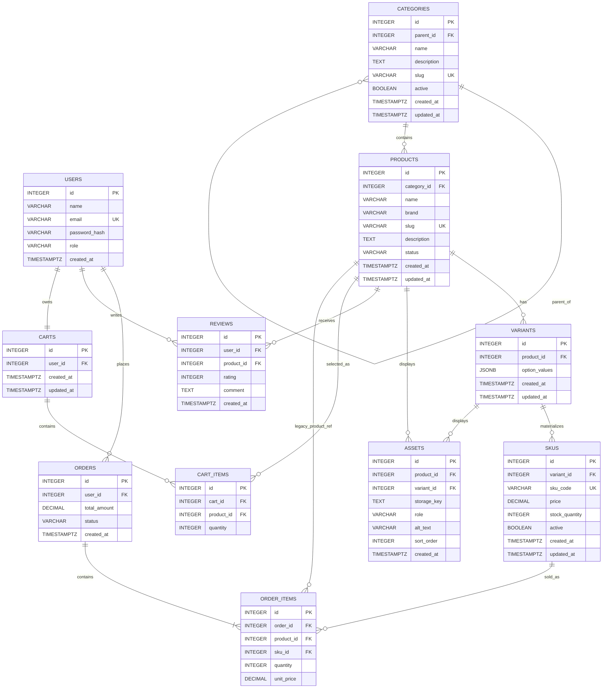

# SPRINT 2 — Catalog Data Foundation

## 1. Sprint goal and scope boundary

Sprint 2 turns the Sprint 1 Mobile Store architecture into a reliable catalog database foundation. The implementation uses the Sprint 1 stack: Node.js/Express.js and PostgreSQL, with React remaining the planned frontend.

### In scope
- Category tree management with stable identifiers and unique slugs.
- Product creation/editing/deactivation with descriptive content and status.
- Variants representing valid option combinations only.
- SKUs with unique codes, price, stock and active status.
- Authenticated administrator operations.
- Database constraints, migrations, seed data and automated tests.

### Out of scope
Dynamic specifications management, asset upload, public catalog search, publication workflows beyond the basic product status, payment gateway integration, order placement, shipping and complete shopper checkout remain later-sprint work.

## 2. Sprint 1 decisions reused/changed

Sprint 1 established the Mobile Store domain, React frontend, Node.js/Express backend, PostgreSQL database and entities including Users, Categories, Products, Reviews, Orders, Order_Items, Cart and Cart_Items.

Sprint 2 extends that model with Variants, SKUs and Assets. The major intentional change is that price and inventory are owned by SKU instead of Product. This preserves product identity while allowing a single product to sell multiple valid configurations at different prices and stock levels.

Sprint 1's future order/cart entities are retained. `order_items.sku_id` is added so future order flows can identify the exact sellable SKU.

## 3. Updated ERD and data dictionary



### Data dictionary

| Entity | Purpose | Key integrity rules |
|---|---|---|
| Categories | Hierarchical mobile categories | Unique slug; optional parent; parent FK RESTRICT; cycles rejected by API |
| Products | Catalog product identity | Unique slug; category FK RESTRICT; status draft/published/inactive |
| Variants | Valid product option combinations | Product FK CASCADE; JSONB object; unique `(product_id, option_values)` |
| SKUs | Sellable inventory identity | Unique SKU code; variant FK CASCADE; price >= 0; stock >= 0 |
| Assets | Future product/variant media | Exactly one owner: product or variant; CASCADE on owner deletion |
| Users | Customers/admins | Unique email; role customer/admin |
| Carts | Sprint 1 shopping cart | One cart per user; user FK RESTRICT |
| Cart_Items | Cart product selections | Positive quantity; product FK RESTRICT |
| Orders | Future order header | User FK RESTRICT; non-negative total |
| Order_Items | Future order lines | Product FK RESTRICT; optional SKU FK RESTRICT; positive quantity; non-negative unit price |
| Reviews | Future customer reviews | User/product FKs RESTRICT; rating 1–5 |

## 4. Administration route table

All `/api/v1/admin/*` routes require `Authorization: Bearer <JWT>` and an authenticated user with role `admin`.

| Method | Route | Purpose |
|---|---|---|
| GET | `/api/v1/admin/categories` | Return category records/tree data |
| POST | `/api/v1/admin/categories` | Create category |
| PATCH | `/api/v1/admin/categories/:id` | Update/deactivate state via `active` |
| DELETE | `/api/v1/admin/categories/:id` | Soft-deactivate category |
| GET | `/api/v1/admin/products` | Return administrative products with variants/SKUs |
| POST | `/api/v1/admin/products` | Create draft/product record |
| PATCH | `/api/v1/admin/products/:id` | Update content/status/category |
| DELETE | `/api/v1/admin/products/:id` | Soft-deactivate product |
| POST | `/api/v1/admin/products/:id/variants` | Add a valid option combination |
| POST | `/api/v1/admin/products/:id/skus` | Add SKU for one of that product's variants |
| PATCH | `/api/v1/admin/skus/:id` | Update price, stock, active status |
| DELETE | `/api/v1/admin/skus/:id` | Deactivate SKU |

### Login example

```http
POST /api/v1/auth/login
Content-Type: application/json

{"email":"admin@mobilestore.local","password":"Admin@12345"}
```

Successful response:

```json
{
  "data": {
    "token": "<JWT>",
    "user": {
      "id": 1,
      "name": "Store Administrator",
      "email": "admin@mobilestore.local",
      "role": "admin"
    }
  }
}
```

### Create category

```http
POST /api/v1/admin/categories
Authorization: Bearer <JWT>
Content-Type: application/json

{
  "name": "Android Phones",
  "slug": "android-phones",
  "parent_id": 1,
  "description": "Android smartphones"
}
```

### Create product

```http
POST /api/v1/admin/products
Authorization: Bearer <JWT>
Content-Type: application/json

{
  "name": "Galaxy S25",
  "brand": "Samsung",
  "slug": "samsung-galaxy-s25",
  "description": "Premium Android smartphone.",
  "status": "draft",
  "category_id": 2
}
```

### Create variant

```http
POST /api/v1/admin/products/1/variants
Authorization: Bearer <JWT>
Content-Type: application/json

{
  "option_values": {
    "storage": "256GB",
    "color": "Black"
  }
}
```

### Create SKU

```http
POST /api/v1/admin/products/1/skus
Authorization: Bearer <JWT>
Content-Type: application/json

{
  "variant_id": 1,
  "sku_code": "SAM-S25-BLK-256",
  "price": 239999,
  "stock_quantity": 12,
  "active": true
}
```

Errors use a consistent shape:

```json
{
  "error": {
    "code": "DUPLICATE",
    "message": "A record with the same unique value already exists."
  }
}
```

Duplicate slug/SKU uses HTTP 409. Validation uses HTTP 400. Missing authentication uses HTTP 401. Non-admin authentication uses HTTP 403. Missing resources use HTTP 404.

## 5. Data integrity and authorization decisions

### Product publication
A draft product may have no SKU. A product may be created before its variants/SKUs are complete. A product can only be changed to `published` when at least one active SKU has positive stock. This prevents a published catalog item from having no sellable SKU.

### Category assignment
A product has one canonical category in Sprint 2 because this directly extends the Sprint 1 `category_id` relationship and avoids adding an unnecessary many-to-many bridge during the catalog-foundation sprint.

### Parent deactivation
Deactivating a parent category does not silently deactivate children. Existing products cannot be assigned to an inactive category, and active products cannot be changed to use an inactive category. A later publication/catalog sprint can define public visibility rules for inactive category branches.

### Out-of-stock SKU
The SKU remains stored with `stock_quantity = 0` and may remain active as an inventory record, but it is not considered sellable. A published product therefore requires an active SKU with stock > 0.

### Prices
Two SKUs may share the same price. There is no product-level price override because Sprint 2 makes SKU price the canonical sellable price. This prevents ambiguity when variants have different prices.

### Negative stock and duplicate codes
Application validation rejects invalid values early, while PostgreSQL CHECK and UNIQUE constraints enforce the rules at database level. Negative stock is impossible through normal writes. SKU codes and product/category slugs are unique.

### Future cart/order references
Products and SKUs are deactivated rather than physically deleted through admin APIs. This preserves historical references for future cart/order workflows. Foreign keys for cart/order history use RESTRICT where appropriate.

### Variant combinations
A Variant is one valid option combination for a Product. PostgreSQL's unique `(product_id, option_values)` index prevents the same combination from being entered twice. A combination that does not exist is simply absent; it is not represented by a fake zero-stock SKU.

### Delete/update policies
- Category → Product: `ON DELETE RESTRICT`, `ON UPDATE CASCADE`.
- Category → child Category: `ON DELETE RESTRICT`, `ON UPDATE CASCADE`.
- Product → Variant: `ON DELETE CASCADE`.
- Variant → SKU: `ON DELETE CASCADE`.
- Product → Review/Cart_Item/Order_Item: `ON DELETE RESTRICT` to protect future business history.
- SKU → Order_Item: `ON DELETE RESTRICT`.
- User → Cart/Order/Review: `ON DELETE RESTRICT`.

## 6. Seed data and demonstration

Run:

```bash
npm run migrate
npm run seed
```

Seed contains:
- Two-level category tree: Mobile Phones → Android Phones.
- Three products: Galaxy S25, Pixel 10 and iPhone 17.
- Four valid SKUs.
- Galaxy S25 has multiple variants.
- One intentionally unavailable combination is not represented as a SKU: Galaxy S25 / White / 1TB.
- Development admin account: `admin@mobilestore.local` / `Admin@12345`.

For a clean demonstration:

```bash
docker compose down -v
docker compose up -d
npm run migrate
npm run seed
npm start
```

Then login and use the returned JWT for the admin routes. Never commit production tokens or private URLs.

## 7. Test strategy, command and result

### Automated coverage
- Required product/SKU fields.
- Slug format validation.
- Unauthorized administrative access.
- Duplicate slug and SKU are protected by database UNIQUE constraints.
- Category cycle prevention in the update route.
- Variant combination uniqueness in PostgreSQL.
- Negative stock and negative price are rejected by API and database CHECK constraints.
- Published products require a sellable SKU.

Run unit/API tests:

```bash
npm test
```

Run with PostgreSQL database reachability test:

```bash
RUN_DB_TESTS=true npm test
```

The repository intentionally does not claim a test result that has not been executed in the review environment. After local setup, the command above provides the reproducible result.

## 8. Known limitations and Sprint 3 backlog

Sprint 2 deliberately does not implement public catalog search, dynamic specifications UI/workflows, asset upload, publication workflow automation, payment, shipping or checkout.

Sprint 3 can safely build on:
- Stable category/product/variant/SKU identities.
- SKU-level price and inventory.
- Existing cart/order/review relationships.
- Authenticated admin APIs.
- Database-level integrity constraints.

Suggested Sprint 3 backlog:
1. Dynamic specifications with a validated JSONB/EAV rule.
2. Asset upload/storage integration.
3. Public catalog reads, search and filtering.
4. Publication/read-visibility rules.
5. Catalog-to-cart readiness using SKU identity.

## Sprint 2 implementation addendum

### Specification representation and validation
Sprint 2 keeps dynamic specification **workflows** out of scope, but the required data model is represented on `products.specifications` as JSONB. The value must be a JSON object; keys must match `[A-Za-z][A-Za-z0-9_]*`; values may be strings, numbers, booleans, or arrays containing only those scalar types. Nested objects, null values, and invalid keys are rejected by API validation, and the database also enforces the top-level JSON object shape.

### Variant administration
In addition to variant creation, the admin API supports listing, updating, and deleting variants through:
- `GET /api/v1/admin/products/:id/variants`
- `POST /api/v1/admin/products/:id/variants`
- `PATCH /api/v1/admin/products/:productId/variants/:variantId`
- `DELETE /api/v1/admin/products/:productId/variants/:variantId`

Deleting a variant cascades to its SKUs because SKU identity belongs to the variant.

### Automated tests
The repository contains validation tests for slugs, specifications, and variant option objects, API authorization tests, and optional PostgreSQL constraint tests enabled with `RUN_DB_TESTS=true`. The database tests verify the presence of non-negative price/stock checks, uniqueness constraints for product slugs/SKU codes/variant combinations, and the product specification JSON-object constraint.
